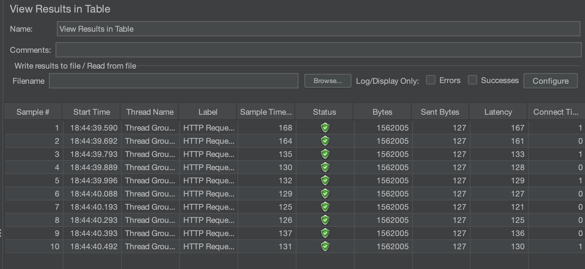
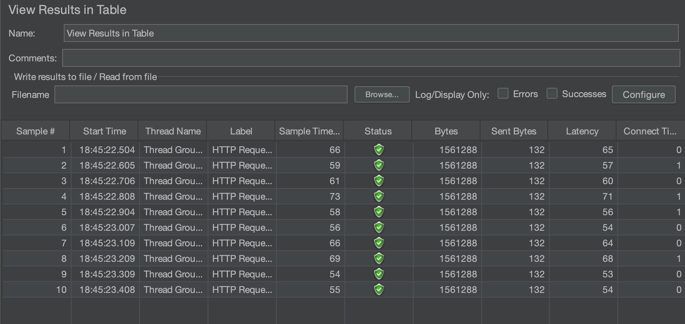
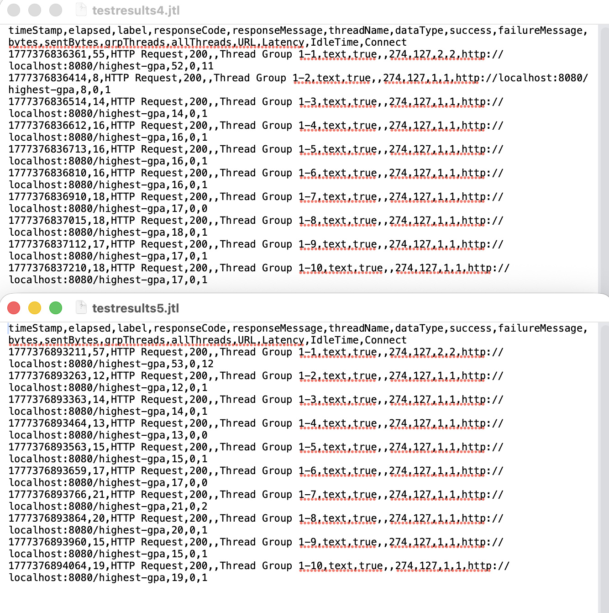
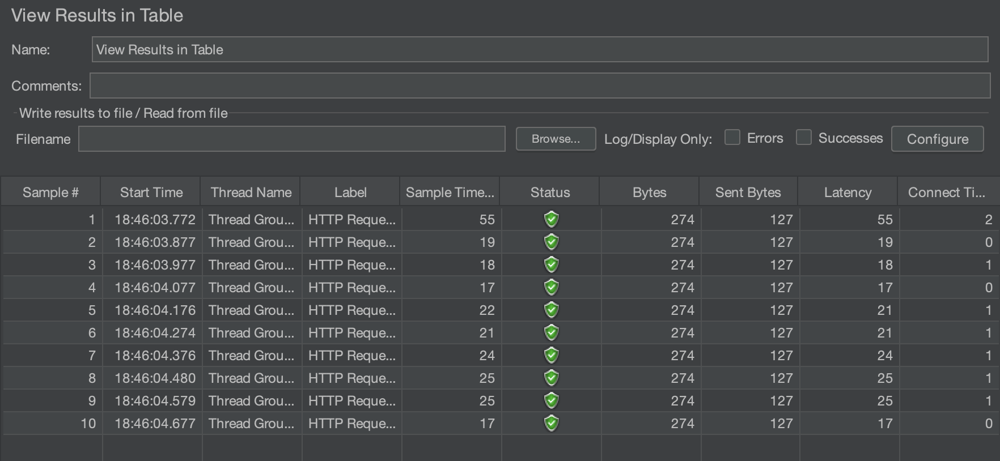

# Profiling Exercise

**Nama:** Dimas Abyan Diasta  
**NPM:** 2406432633  
**Branch Optimasi:** `optimize`

## Ringkasan Pengerjaan

Pada tugas ini saya melakukan dua hal utama, yaitu performance testing dengan JMeter dan profiling dengan IntelliJ Profiler. Alur yang saya pakai cukup sederhana. Saya jalankan aplikasi, isi database dengan data seed, ukur performa tiap endpoint, cari bottleneck yang paling jelas di profiler, lalu refactor kode yang memang terbukti mahal. Setelah itu saya ulang lagi pengukurannya untuk melihat apakah hasil optimasinya benar terasa.

Endpoint yang saya fokuskan adalah:

1. `/all-student`
2. `/all-student-name`
3. `/highest-gpa`

## Konfigurasi Pengujian

Saya menggunakan konfigurasi JMeter yang sama untuk tiap endpoint:

1. Number of Threads: `10`
2. Ramp-Up Period: `1`
3. Loop Count: `1`

Saya juga mengikuti catatan pada tutorial bahwa hasil request pertama tidak selalu ideal untuk dijadikan patokan karena JVM masih melakukan warm-up. Karena itu, saat membandingkan hasil optimasi saya lebih memperhatikan request yang sudah stabil dibanding request pertama.

## Hasil Performance Testing

### 1. Endpoint `/all-student`

Sebelum optimasi, endpoint ini adalah yang paling berat. Dari hasil JMeter, sample time untuk `/all-student` masih berada di kisaran `125 ms` sampai `168 ms`. Dari angka itu terlihat bahwa bottleneck-nya cukup besar dan konsisten muncul di hampir semua request.

Setelah saya profiling, penyebab utamanya ternyata berasal dari pola query yang berulang di `getAllStudentsWithCourses()`. Sebelumnya service mengambil semua student lebih dulu, lalu untuk setiap student melakukan query lagi ke tabel relasi course. Pola ini menghasilkan N+1 query dan itu memang terasa sangat mahal saat data yang dipakai mulai banyak.

Optimasi yang saya lakukan untuk endpoint ini adalah mengganti pola tersebut menjadi satu query `join fetch` lewat repository. Setelah perubahan itu, waktu respons turun sangat jauh. Dari pengujian setelah warm-up, sample time stabil di sekitar `3.56 ms`. Kalau dibandingkan dengan rata-rata awal sekitar `137.7 ms`, peningkatannya ada di kisaran `97.41%`.

Menurut saya ini jadi contoh paling jelas bahwa bottleneck terbesar bukan selalu ada di loop Java, tapi sering kali justru ada di cara kita mengakses database.

### 2. Endpoint `/all-student-name`

Untuk endpoint ini, hasil awalnya sebenarnya tidak seburuk `/all-student`, tetapi tetap terlihat ada ruang untuk diperbaiki. Pada hasil awal, sample time berada di kisaran `54 ms` sampai `73 ms`.

Setelah saya cek lagi, ada dua hal yang bisa dibenahi. Pertama, method ini tetap memanggil `findAll()` padahal yang dibutuhkan hanya nama mahasiswa. Kedua, proses penggabungan string masih dilakukan dengan concatenation biasa di dalam loop. Untuk data besar, pola seperti ini jelas membebani alokasi objek string dan membuat prosesnya kurang efisien.

Saya ubah implementasinya dengan query yang hanya mengambil field nama, lalu hasilnya saya gabungkan menggunakan `StringJoiner`. Setelah itu hasil pengukuran yang stabil turun ke sekitar `45.3 ms`. Jika dibandingkan dengan rata-rata awal sekitar `61.7 ms`, peningkatannya ada di kisaran `26.58%`.

Perubahannya memang tidak sedrastis endpoint pertama, tapi tetap lolos target peningkatan minimal `20%`. Dari sini saya belajar bahwa optimasi kecil di level pengolahan string tetap bisa memberi dampak nyata kalau endpoint-nya sering dipanggil.

### 3. Endpoint `/highest-gpa`

Untuk endpoint ini saya menyertakan bukti hasil test dalam satu gambar `TestResult.png`, sesuai hasil yang saya pakai sebagai referensi akhir.

Saya juga menyimpan screenshot hasil JMeter untuk endpoint ini:

Sebelum optimasi, endpoint `/highest-gpa` masih melakukan pencarian GPA tertinggi dengan cara mengambil semua student ke memory, lalu membandingkan satu per satu di Java. Secara logika hasilnya benar, tetapi dari sisi performa pendekatannya tidak efisien karena database sebenarnya lebih cocok menangani operasi seperti ini.

Saya pindahkan logika tersebut ke repository dengan method `findFirstByOrderByGpaDesc()`. Setelah itu saya validasi lagi memakai `testresults4.jtl` dan `testresults5.jtl`. Jika request pertama tetap dihitung, rata-ratanya berada di `19.60 ms` dan `20.30 ms`. Namun setelah request pertama saya abaikan untuk mengurangi efek warm-up, rata-ratanya turun ke sekitar `15.67 ms` dan `16.22 ms`.

Kalau hasil stabil itu dibandingkan dengan rata-rata awal sekitar `24.3 ms`, peningkatannya ada di kisaran `35%`. Buat saya hasil ini cukup masuk akal. Endpoint ini sejak awal memang tidak seberat `/all-student`, jadi ruang optimasinya juga tidak sebesar itu. Walaupun begitu, memindahkan pencarian maksimum ke database tetap membuat implementasinya lebih tepat dan lebih efisien.

## Ringkasan Optimasi Kode

Secara garis besar, perubahan yang saya buat adalah sebagai berikut:

1. Menghilangkan pola N+1 query pada endpoint `/all-student` dengan `join fetch`.
2. Memindahkan pencarian student dengan GPA tertinggi ke database lewat repository method `findFirstByOrderByGpaDesc()`.
3. Mengambil nama student saja untuk endpoint `/all-student-name` agar tidak memuat objek penuh yang sebenarnya tidak dibutuhkan.
4. Mengganti concatenation string di dalam loop menjadi `StringJoiner`.

Menurut saya ketiga perubahan ini cukup representatif karena semuanya langsung menyasar bottleneck yang benar-benar terlihat saat profiling, bukan sekadar mengubah kode yang kelihatan "kurang bagus" secara style.

## Kesimpulan Hasil Pengujian

Kalau saya rangkum, hasil akhirnya seperti ini:

| Endpoint | Sebelum Optimasi | Sesudah Optimasi | Peningkatan |
| --- | ---: | ---: | ---: |
| `/all-student` | `137.7 ms` | `3.56 ms` | `97.41%` |
| `/all-student-name` | `61.7 ms` | `45.3 ms` | `26.58%` |
| `/highest-gpa` | `24.3 ms` | `15.67 ms` | `35.51%` |

Dari tabel ini, saya bisa lihat bahwa semua endpoint yang diuji berhasil melewati target peningkatan minimal `20%`. Endpoint yang paling terasa perbaikannya adalah `/all-student`, karena masalah awalnya memang paling mahal dan paling jelas.

## Reflection

### 1. What is the difference between the approach of performance testing with JMeter and profiling with IntelliJ Profiler in the context of optimizing application performance?

Menurut saya perbedaan utamanya ada di sudut pandang. JMeter melihat aplikasi dari luar, jadi yang terlihat adalah seberapa cepat endpoint merespons request, seberapa stabil hasilnya, dan bagaimana perilakunya saat diberi beban tertentu. Sementara itu IntelliJ Profiler melihat dari dalam, jadi saya bisa tahu method mana yang paling banyak menghabiskan CPU time dan bagian kode mana yang paling layak dicurigai sebagai bottleneck.

Kalau disederhanakan, JMeter membantu saya menjawab pertanyaan "aplikasi ini lambat atau tidak", sedangkan profiler membantu saya menjawab "bagian mana yang membuatnya lambat". Menurut saya keduanya tidak bisa saling menggantikan. JMeter bagus untuk membuktikan ada masalah performa, sedangkan profiler penting untuk memastikan solusi yang saya lakukan benar-benar menyasar akar masalahnya.

### 2. How does the profiling process help you in identifying and understanding the weak points in your application?

Profiling membantu saya karena hasilnya jauh lebih konkret dibanding sekadar menebak-nebak dari kode. Saat melihat flame graph, timeline, dan method list, saya bisa langsung melihat method mana yang paling mahal. Dari sana saya tidak lagi asal menganggap loop tertentu pasti lambat atau query tertentu pasti berat, karena semua sudah terlihat dari data profiling.

Pada tugas ini, profiling sangat membantu saat saya melihat bahwa `getAllStudentsWithCourses()` mendominasi beban pada endpoint `/all-student`. Dari situ saya jadi paham bahwa masalah utamanya bukan hanya karena ada loop, tetapi karena di dalam loop itu ada akses database berulang. Jadi profiling bukan cuma membantu menemukan titik lemah, tetapi juga membantu saya memahami kenapa titik itu lemah.

### 3. Do you think IntelliJ Profiler is effective in assisting you to analyze and identify bottlenecks in your application code?

Iya, menurut saya IntelliJ Profiler cukup efektif. Alasan utamanya karena hasilnya langsung terhubung ke struktur kode yang sedang saya kerjakan. Saya bisa pindah dari hasil flame graph ke method yang bersangkutan tanpa perlu alat lain. Itu membuat proses analisis jadi lebih cepat dan lebih mudah dipahami.

Yang paling terasa buat saya adalah kemudahan saat membandingkan sebelum dan sesudah optimasi. Setelah saya refactor, saya bisa lihat apakah CPU time di method target benar-benar turun atau tidak. Jadi profiler ini bukan cuma berguna untuk menemukan masalah awal, tapi juga untuk mengecek apakah solusi yang saya buat memang ada dampaknya.

### 4. What are the main challenges you face when conducting performance testing and profiling, and how do you overcome these challenges?

Tantangan terbesarnya menurut saya ada tiga. Pertama, hasil pengukuran mudah berubah kalau aplikasi baru pertama kali dijalankan karena JVM masih warm-up. Kedua, kalau data yang dipakai terlalu sedikit, bottleneck jadi kurang kelihatan. Ketiga, kadang kita tergoda untuk langsung optimasi berdasarkan feeling, padahal belum tentu itu sumber masalahnya.

Cara saya mengatasinya adalah dengan menjalankan endpoint beberapa kali, memperhatikan hasil yang sudah stabil, dan tetap memakai data seed dalam jumlah yang cukup besar. Selain itu saya selalu mencoba menghubungkan hasil JMeter dengan hasil profiler. Jadi saya tidak hanya melihat endpoint mana yang lambat, tetapi juga memastikan bahwa perubahan yang saya buat memang menjawab penyebab keterlambatan tersebut.

### 5. What are the main benefits you gain from using IntelliJ Profiler for profiling your application code?

Manfaat paling utama yang saya rasakan adalah saya jadi bisa membuat keputusan optimasi yang lebih tepat. Tanpa profiler, saya mungkin tetap bisa menebak bahwa ada masalah di query atau string handling, tetapi saya tidak punya bukti yang cukup kuat untuk menentukan prioritas perbaikannya.

Dengan IntelliJ Profiler, saya juga jadi lebih mudah membedakan mana masalah yang benar-benar penting dan mana yang cuma kelihatan "kurang ideal" di mata saya. Buat saya ini penting, karena optimasi yang baik seharusnya fokus pada bagian yang paling berdampak, bukan sekadar merapikan semua hal yang kelihatan bisa diubah.

### 6. How do you handle situations where the results from profiling with IntelliJ Profiler are not entirely consistent with findings from performance testing using JMeter?

Kalau hasil profiler dan hasil JMeter tidak sepenuhnya konsisten, saya anggap itu bukan berarti salah satu alatnya keliru. Biasanya itu berarti saya perlu melihat konteks pengukurannya lagi. JMeter mengukur dari sisi request end-to-end, jadi dia ikut menangkap efek jaringan, serialisasi response, dan perilaku runtime secara umum. Sementara profiler lebih fokus ke aktivitas method di dalam aplikasi.

Karena itu, kalau ada perbedaan hasil, saya biasanya kembali cek skenario test, jumlah data, kondisi aplikasi saat pengukuran, dan apakah request pertama ikut dihitung atau tidak. Saya juga lebih percaya pada pola yang berulang daripada satu angka tunggal. Dengan cara itu saya bisa menarik kesimpulan yang lebih adil dan tidak terburu-buru.

### 7. What strategies do you implement in optimizing application code after analyzing results from performance testing and profiling? How do you ensure the changes you make do not affect the application's functionality?

Strategi yang saya pakai adalah mengutamakan perubahan yang paling dekat dengan bottleneck yang terbukti. Jadi saya tidak langsung melakukan refactor besar-besaran, melainkan fokus ke satu masalah yang jelas lebih dulu. Pada tugas ini urutannya adalah memperbaiki query yang berulang, memindahkan pencarian maksimum ke database, lalu memperbaiki penggabungan string.

Supaya fungsionalitasnya tetap aman, saya memastikan endpoint yang sama masih mengembalikan hasil yang benar setelah refactor. Saya juga menambahkan test untuk service agar perilaku utamanya tetap terjaga. Buat saya, optimasi yang bagus itu bukan cuma membuat kode lebih cepat, tetapi juga tetap menjaga hasil akhirnya tidak berubah.
